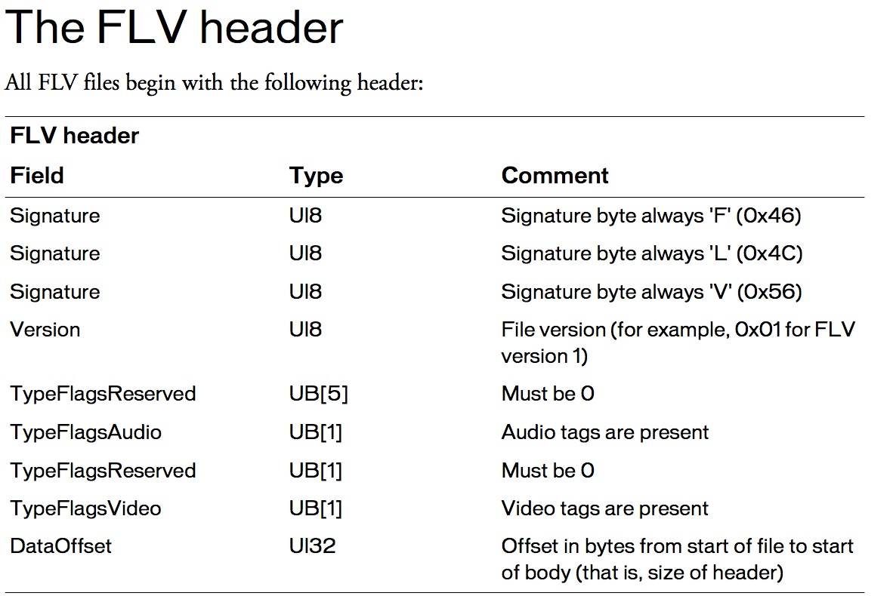

# GO struct 小结
---

以下示例可参考 [struct.go](./Example/struct.go)

## 基本使用

### 定义

	const (
		male = iota
		female
	)
	
	type Person struct {
		Name   string
		Age    uint8
		Gender int
	}

### 构造

使用 new，得到一个指针

	alex := new(Person)
	alex.Name = "Alex"
	alex.Age = 33
	alex.Gender = male

直接复制

	lilei := Person{"LiLei", 20, male}

指针赋值

	hanmeimei := &Person{"HanMeimei", 19, female}

### 打印

对于结构体可以使用 %v 进行格式化打印

	fmt.Printf("Use fmt.Printf:\n%v\n%v\n%v\n", alex, lilei, hanmeimei)
	
结果

	Use fmt.Printf:
	&{Alex 33 0}
	{LiLei 20 0}
	&{HanMeimei 19 1}

可以看见，第一和第三种赋值方式，得到的是类型指针，第二种方式得到的是类型实例

## 成员函数

成员函数定义

	func (p *Person) Work(content string) {
		fmt.Printf("%s %s\n", p.Name, content)
	}
	
成员函数调用

	alex.Work("Just do IT")

输出结果

	Alex Just do IT

在上例中，(p *Person) 用于指定函数归属类型和使用该类型的实例 p，这里的 p 有点像 Python 中的 self，不同的是单独定义的。

上例中还可以写成非指针模式的 (p Person)，不同的是，指针模式在函数内修改实例的变量，在外部会生效，非指针模式不会。一般习惯上更常用指针方式进行传递

## 继承

将父类的结构放到子类的结构中完成继承

	type Student struct {
		Person
		School string
	}

构造子类实例

	xiaoming := Student{Person{"Xiaoming", 17, male}, "First School"}

打印

	fmt.Println(xiaoming, xiaoming.Name, xiaoming.School)

结果

	{{Xiaoming 17 0} First School} Xiaoming First School

子类实例调用父类方法

	xiaoming.Work("Study")

结果

	Xiaoming Study

## 多态

GO 中的多态需要配合 interface 实现

	type Tool interface {
		Use()
	}
	
	type Car struct {
	}
	
	func (c *Car) Use() {
		fmt.Println("Drive Drive Run")
	}
	
	type Gun struct {
	}
	
	func (g *Gun) Use() {
		fmt.Println("Shoot Shoot Win")
	}
	
	type Gamer struct {
		tool Tool
	}
	
	func (g *Gamer) Get(t Tool) {
		g.tool = t
	}
	
	func (g *Gamer) UseTool() {
		if g.tool == nil {
			fmt.Println("No tool")
			return
		}
		g.tool.Use()
	}

上例中，我们定义了 Car 和 Gun 两种方法，并且都定义了 Use 方法，因此他们为 Tool 的实现。我们用 Gamer 去获取 Tool，并且使用 UseTool，这里可以看到，对于不同工具的使用效果

需要注意，Gamer 的 tool 在这里不能声明为 *Tool

输出

	No tool
	Drive Drive Run
	Shoot Shoot Win

## 二进制方式读写

可以使用二进制方式对结构进行赋值，使用 binary 库，这种方式在处理二进制文件或网络编程中用得比较多

这里以读取一个 flv 文件头为例，flv 文件头格式：

定义匹配的结构体

	type FLVHeader struct {
		Signature  [3]byte
		Version    uint8
		Flags      uint8
		DataOffset uint32
	}

将二进制文件读入结构体中

	f, _ := os.Open("test.flv")
	flvHeader := new(FLVHeader)
	binary.Read(f, binary.BigEndian, flvHeader)
	fmt.Println(flvHeader)

输出：

	&{[70 76 86] 1 5 9}