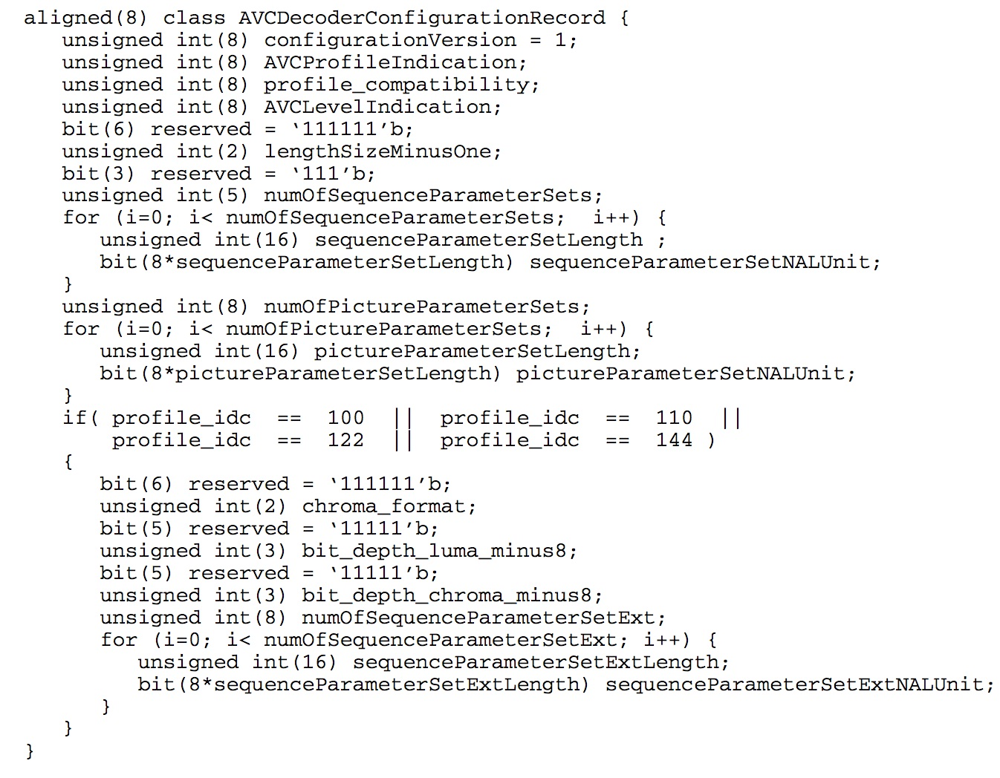
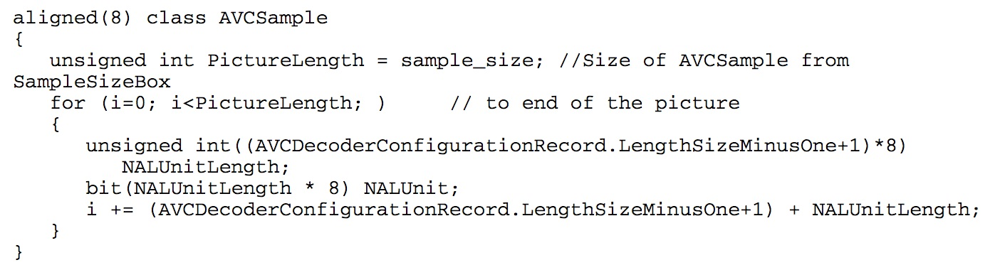
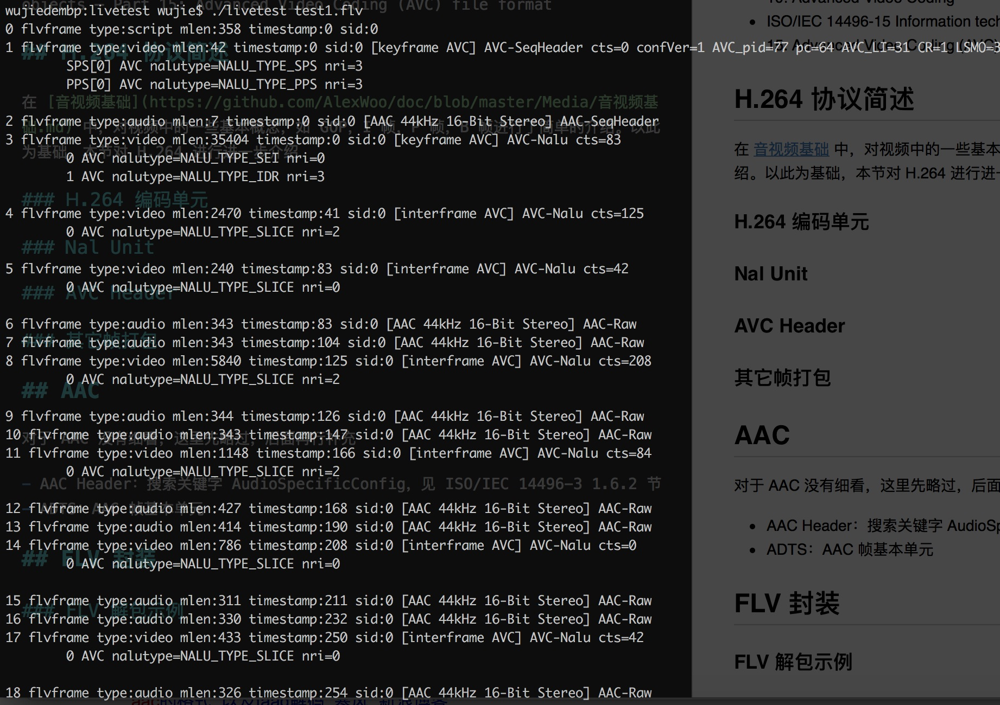
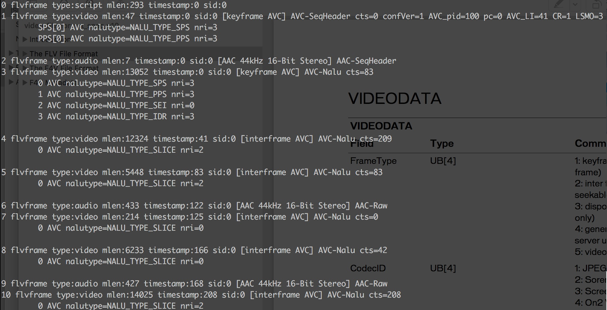

# AVC(H.264) FLV 打包
---
参考资料

- Video File Format Specification Version 10
- ISO/IEC 14496-3 Information technology — Coding of audio-visual objects — Part 3: Audio
- ISO/IEC 14496-10 Information technology — Coding of audio-visual objects — Part 10: Advanced Video Coding
- ISO/IEC 14496-15 Information technology — Coding of audio-visual objects — Part 15: Advanced Video Coding (AVC) file format

## H.264 协议简述

在[音视频基础](https://github.com/AlexWoo/doc/blob/master/Media/音视频基础.md)中，对视频中的一些基本概念，如 GOP，I 帧，P 帧，B 帧进行了简单的介绍。以此为基础，本节对 H.264 进行进一步介绍

### H.264 编码单元

视频编码中，原始图像一般使用 YUV 或 RGB 两种方式，在[音视频基础](https://github.com/AlexWoo/doc/blob/master/Media/音视频基础.md)中已经做过简单介绍，这里就不在赘述

H.264 中，图像的基本编码单元并不是一张完整的图像，H.264 的最小编码单元为块(block)，多个块构成一个宏块(macroblock)，多个宏块构成一个片(slice)，多个片构成一帧，即一张图像

视频播放中，按照帧率，一帧一帧的图像播放，形成一个连续的画面

在 H.264 中，在封装过程中，基本单元是 Nal Unit，每个 Nal Unit 的最小装载单位是一个 slice，也就是一帧是可以分成多个 Nal Unit 的

在[音视频基础](https://github.com/AlexWoo/doc/blob/master/Media/音视频基础.md)我们提到了 I 帧，P 帧，B 帧的概念，而在 H.264 中，实际上是 I-Slice，P-Slice 和 B-Slice。在一帧图像中，Slice 的编码可以参照同一帧中的其它 Slice。

### Nal Unit(Nalu)

在 H.264 中，并不只有视频编码 Nalu，还有一些辅助 Nalu，Nalu 类型使用 nal\_unit\_type 进行标记。常见的有(ISO/IEC 14496-10 Table 7-1)：

- 1: Coded slice of a non-IDR picture
	
	非 IDR 帧的 Slice，使用这个 nal\_unit\_type 表示 Slice 所属视频帧没有被切分成多个 Slice

- 2: Coded slice data partition A

	使用这个 nal\_unit\_type 表示 Slice 所属视频帧被切分成多个 Slice

- 3: Coded slice data partition B
	
	使用这个 nal\_unit\_type 表示 Slice 所属视频帧被切分成多个 Slice

- 4: Coded slice data partition C

	使用这个 nal\_unit\_type 表示 Slice 所属视频帧被切分成多个 Slice

- 5: Coded slice of an IDR picture

	IDR 帧的 Slice

- 6: Supplemental enhancement information(SEI)

	补充增强信息，不会参与播放器解码，这个 Nalu 通常用来携带一些私有信息。如直播系统中，可以在主播推流时在 SEI 中周期性打入绝对时间，播放端可以通过该帧携带的时间与当前时间进行比较，用于测量直播延时

- 7: Sequence parameter set(SPS)

	序列参数集，包含了视频解码中的一些关键参数

- 8: Picture parameter set(PPS)

	图像参数集，包含了图像解码中的一些关键参数

SPS 和 PPS 包含了视频解码的关键信息，所以，在一般传输和使用过程中，通常会先把 SPS 和 PPS 打包成 AVC 头。视频播放器要先拿到 SPS 和 PPS 后才能对视频进行解码

除了 nal\_unit\_type 外，Nalu 还有一个比较关键的信息是 nal_ref_idc，该数据表明本 Nalu 的重要程度，0-3，越大表示越重要，0 表示该 Nalu 是可以被抛弃的。

通常 SPS 和 PPS 的 nal_ref_idc 为 3，优先级很高。而 SEI 的 nal_ref_idc 为 0。

在视频帧中，一般 I-Slice 和 P-Slice 会被其它 Nalu 参考， nal_ref_idc 不为 0，通常 IDR 帧的 nal_ref_idc 为 3，P-Slice 为 2。而 B-Slice 为 0，即 B-Slice 不被其它 Nalu 参考，是可以被抛弃的。

### AVC Header

参考 ISO/IEC 14496-15

在存储为文件(FLV，MP4，TS)或进行网络传输时，H.264 通常需要把 SPS 和 PPS 单独打包成一个 AVC Header。对 AVC Header 打包可参考 ISO/IEC 14496-15 5.2.4.1.1

从图中，我们可以看到，从语义上看，AVC 头中是可以打包多个 SPS 和多个 PPS 的，每个 SPS 或 PPS Nalu 前有一个 16 位的长度字段。但是一般在打包过程中一般只会打入一个 SPS 和一个 PPS Nalu

具体字段含义参考 ISO/IEC 14496-15 5.2.4.1.2

### 其它帧打包

对于视频帧打包，参考 ISO/IEC 14496-15 5.3.4.2.1

在 FLV 打包时，没有 SampleSizeBox 的字段(用于 MP4)，一般打包格式如下：

length(32bit) Slice length(32bit) Slice ...

一帧数据可以放入一到多个 Slice

## AAC

对于 AAC 没有细看，这里先略过，后面再行补充

- AAC Header：搜索关键字 AudioSpecificConfig，见 ISO/IEC 14496-3 1.6.2 节
- ADTS：AAC 帧基本单元

## FLV 封装

在 FLV 封装中，遵循 H.264 通常的打包规律，一帧数据中可以放入一到多个 Slice。

SPS 和 PPS 必须提取并打包进 AVC Header 中，FrameType 设置为 1(keyframe)，CodecID 设置为 7(AVC)，AVCPacketType 设置为 0(AVC sequence header)

SPS 除了在视频头中放置外，还可以打包进 IDR 帧中，可以参考下面的示例 2

SEI 一般不单独打包，一般和 IDR 帧一起打包

在 FLV 中，视频的播放时间取决于 FLV Tag 中的 TimeStamp，视频 Payload 中的时间将会被忽略

### FLV 解包示例

示例 1

示例 2

[FLV 解包使用的项目地址](https://github.com/AlexWoo/livetest)，目前还在完善过程中，后续计划会添加 AAC 头的 Parser，AMF 的编解码，MP4，TS 的 Parser，RTMP、HTTP-FLV 和 HLS 的 Parser，RTMP 推流测试工具等。欢迎关注

从图中可以看到，一般一个 FLV 文件的帧结构：

- Metadata
- Video Header

	一般会包含 SPS 和 PPS，SPS 和 PPS 有可能会有多个

- Audio Header
- Video Frame

	一般第一个关键帧中可能会先有一个 SEI，然后才是 IDR 帧
	一个 FLV 视频帧可以包含一个或多个 SLICE

- Audio Frame
