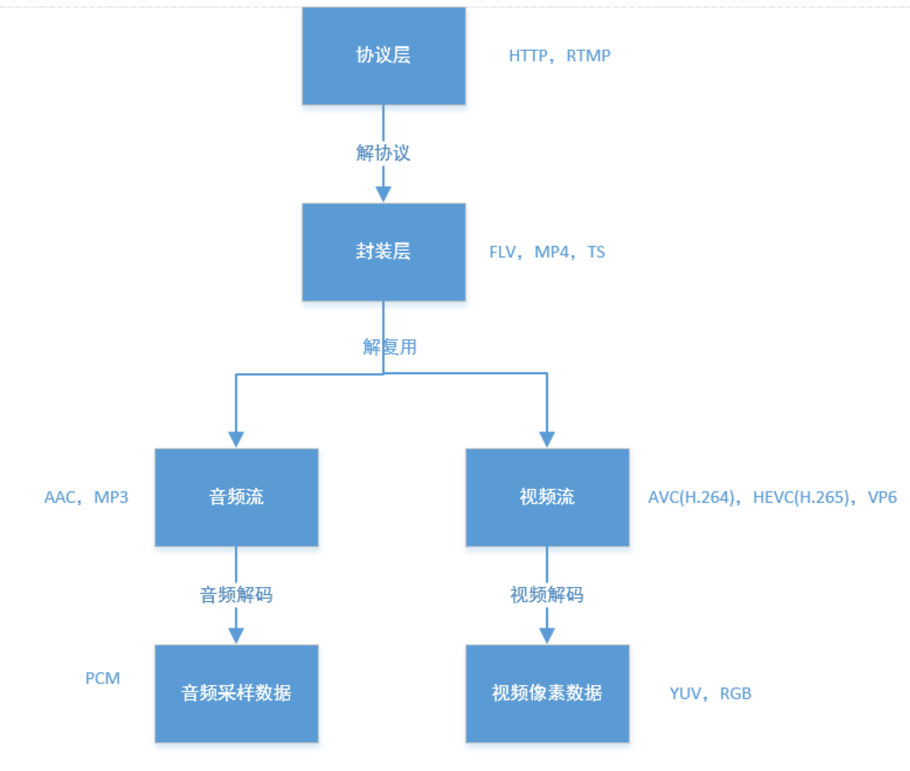

# 音视频基础
---
## 音视频编解码过程

- 协议层：存放音视频封装的文件或传输音视频封装的协议，如 HTTP，RTMP，HLS 等
- 封装层：将音视频流，字幕流等多个流封装在一起，并对这些流进行时间同步，一般 PTS 会放在这一层，如 FLV，MP4，TS 等
- 音频流：将封装层音视频流进行分离会得到压缩的音频流
- 视频流：将封装层音视频流进行分离会得到压缩的视频流
- 音频采样数据：对音频流进行解码，得到音频采样数据，即原始的音频数据，如 PCM
- 视频像素数据：对视频流进行解码，得到视频像素数据，即原始的视频图像数据，常见的有 YUV 和 RGB

## 音频编解码

音频是一个震荡的波形，波形的变化对应声压的变化，人耳通过感受不同的声压，形成声音。数字编码中，在 1s 内，对声压进行采样的次数称为采样率。每个采样点用一个数字来表示声压的大小。采样率越高，表示 1s 内采样点个数越多，越接近模拟声音。

在数字技术中，音频的表示形式就是一组数字，每个数字代表一个采样点声压的大小。在音频中会存在单声道 8bit 编码，双声道 8bit 编码。在音频中，对于单声道 8bit 编码，就是用一个 8bit 的数字表示声压大小，每个字节一个采样点；对于双声道 16bit 编码，就是用两个 8bit 的数字分别表示左右声道的大小，没两个字节一个采样点。以此类推。

在音频中，采样率是一个很关键的参数，表示每秒钟采样点的个数。如 44.1KHz，即每秒 44100 个采样点。在直播中常用的 AAC 编码是 1024 个采样点一帧音频数据，因此 44.1KHz 的 AAC，音频帧的间隔是 1024\*(1000000/44100)，即 23220 微妙，即 23.22 毫秒。MP3 编码是 1152 个采样点一帧音频数据，因此 44.1KHz 的 AAC，音频帧的间隔是 1152\*(1000000/44100)，即 26122 微妙，即 26.122 毫秒

## 视频编解码

### RGB 和 YUV

视频实际上是一组图像按照一定的顺序和间隔进行播放，每秒播放图像的数量称为帧率，如帧率 24 表示 1s 钟播放 24 张图像。图像通常有两种表示方式：

- RGB

	RGB 即三原色中的红绿蓝，通过不同比例的搭配可以构成所有颜色。以 8 位编码举例，RGB 分别使用 8bit 数字来表示，连续三个字节为一个像素点，1080 * 800 表示横向有 1080 个像素点，纵向有 800 个像素点。在图像格式中常用的 bmp 格式即是使用 RGB 的方式进行编码的。

- YUV

	YUV 是另一种图像的表示方式，Y 表示亮度，U 和 V 表示色度，即色彩和饱和度。如果只显示 Y 的信号，图片是一个黑白图像，叠加上 UV 后即显示为彩色图像。在 YUV 中常见 4:4:4，4:2:2 和 4:2:0 几种编码方式：
	
	- 4:4:4 一个 Y 会对应一个 U 和 一个 V
	- 4:2:2 两个 Y 会对应一个 U 和 一个 V
	- 4:2:0 四个 Y 会对应一个 U 和 一个 V

	在存储时，通常是先存储 Y，再存储 U 和 V。以一个 4:2:0 的编码方式为例，对于 1080 * 800 的分辨率来说，前面的 1-864000 字节表示 Y，864001-1080000 字节表示 U，1080001-1296000 字节表示 V。

### I 帧 P 帧和 B 帧

在视频领域中，我们常听到 I 帧 P 帧和 B 帧。基本概念上，I 帧为一个完全编码的帧，在 H.264 协议中，I 帧又叫 intra-frame，即帧内编码，他的编码不需要参考任何帧。而 P 帧和 B 帧称为 inter-frame，这两种帧编码需要参考其它帧进行编码。其中 P 帧需要参考前面的 I 帧或者 P 帧进行编码。B 帧需要参考前面的 I 帧或者 P 帧，以及后面的 P 帧进行编码。

何为参考编码？视频一般都有图像与图像之间存在一定的关联性，前后两张图片，有一定的变化量，参考编码即是记录两个图像之间的变化(运动矢量)。可见，使用这种方式进行编码，P 帧占用的空间会远比 I 帧小得多，而 B 帧会比 P 帧小得多。这种编码方式即是视频压缩的核心思想。

在视频中，会涉及到场景的切换，这种使用 P 帧进行编码，实际上是不划算的。因此视频中通常会有多个 I 帧，对于一般的电影，在场景切换时，都会使用 I 帧进行编码，而在直播中，更常用的是固定时常一个 I 帧。一般我们会把一个 I 帧到下一个 I 帧前的图片称为 GOP(Group of pictures)，这些帧之间会有一定的关系。

### DTS 和 PTS

在视频领域中，我们常听到一个概念，DTS 和 PTS。DTS 是解码时间，PTS 是显示时间。因为 B 帧的存在，PTS 和 DTS 并不完全相同，因为解码一个 B 帧需要先解码这个 B 帧前的 I 帧或着 P 帧，以及 B 帧后的 P 帧才能完成 B 帧的解码。以一个图片组显示顺序为例：

	I1 B2 B3 P4 B5 B6 P7 B8 B9 P10

对于上面的图片组，解码顺序为：

	I1 P4 B2 B3 P7 B5 B6 P10 B8 B9
