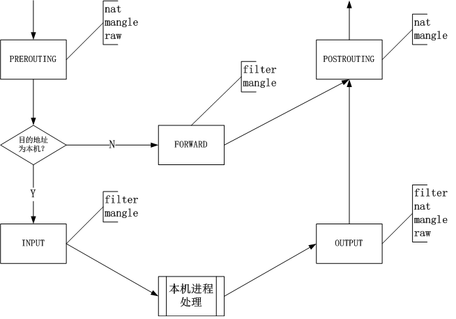

# iptables 常用功能总结
---
iptables 是一个用于 IP 访问控制的工具，可以通过 iptables 实现一些防火墙和 NAT 的功能，以下是对 iptables 常用功能的总结

## 基本概念

### iptables 的 5 条链和 4 张表

iptables 调用内核 Netfilter 进行 IP 访问控制设置，而 Netfilter 在网络层有 5 个钩子：

- PRE_ROUTING
- INPUT
- OUTPUT
- FORWARD
- POST_ROUTING

对应了 iptables 的 5 条链：

- PREROUTING
- INPUT
- OUTPUT
- FORWARD
- POSTROUTING

另外 iptables 有四张表，这四张表即配置了 5 条链上 IP 访问控制规则，这四张表分别为：

- filter：访问控制，规则匹配
- nat：地址转发
- mangle：修改数据包，改变包头中的内容(TTL，MARK等)
- raw：数据报状态跟踪，分析

一般常用到的表为 filter 和 nat 表，iptables 使用 -t 来指定要访问的表，如果不指定，默认为 filter 表，如下面查看 filter 表和 nat 表中的内容：

	[root@AlexWoo-CentOS ~]# iptables -t nat -nL
	Chain PREROUTING (policy ACCEPT)
	target     prot opt source               destination         
	REDIRECT   tcp  --  0.0.0.0/0            0.0.0.0/0           tcp dpt:80 redir ports 8080 
	REDIRECT   tcp  --  0.0.0.0/0            0.0.0.0/0           tcp dpt:443 redir ports 8443 
	
	Chain POSTROUTING (policy ACCEPT)
	target     prot opt source               destination         
	
	Chain OUTPUT (policy ACCEPT)
	target     prot opt source               destination         
	[root@AlexWoo-CentOS ~]# iptables -t filter -nL
	Chain INPUT (policy ACCEPT)
	target     prot opt source               destination         
	ACCEPT     tcp  --  0.0.0.0/0            0.0.0.0/0           tcp dpt:8443 
	ACCEPT     tcp  --  0.0.0.0/0            0.0.0.0/0           tcp dpt:8080 
	ACCEPT     all  --  0.0.0.0/0            0.0.0.0/0           state RELATED,ESTABLISHED 
	ACCEPT     icmp --  0.0.0.0/0            0.0.0.0/0           
	ACCEPT     all  --  0.0.0.0/0            0.0.0.0/0           
	ACCEPT     tcp  --  0.0.0.0/0            0.0.0.0/0           state NEW tcp dpt:22 
	REJECT     all  --  0.0.0.0/0            0.0.0.0/0           reject-with icmp-host-prohibited 
	
	Chain FORWARD (policy ACCEPT)
	target     prot opt source               destination         
	REJECT     all  --  0.0.0.0/0            0.0.0.0/0           reject-with icmp-host-prohibited 
	
	Chain OUTPUT (policy ACCEPT)
	target     prot opt source               destination     

### 5 条链和 4 张表的对应关系

- 当从其它主机收到一个 IP 包：

	1. 先进入 PREROUTING 链，这个时候可以使用 nat、mangle 和 raw 表中配置的规则
	2. 如果目的地址为本机，进入 INPUT 链，这个时候可以使用 filter 和 mangle 表中配置的规则，处理完成后交到对应的应用进程进行处理
	3. 如果目的地址不是本机，进入 FORWARD 链，这个时候可以使用 filter 和 mangle 表中配置的规则
	4. 最后进入 POSTROUTING 链，这个时候可以使用 nat 和 mangle 表中配置的规则

- 当本机向外主动发送一个 IP 包：

	1. 先进入 OUTPUT 链，这个时候可以使用 filter、nat、mangle 和 raw 表中配置的规则
	2. 如果目的地址是本机，进入 INPUT 链，这个时候可以使用 filter 和 mangle 表中配置的规则，处理完成后交到对应的应用进程进行处理
	3. 如果目的地址不是本机，进入 POSTROUTING 链，这个时候可以使用 nat 和 mangle 表中配置的规则

## 常用命令

注：以下只是常用的命令，不包含所有命令，如有兴趣，可以自己通过 man 或其它资料进行研究

### 查看规则

	iptables [-t <table>] -nL

这里的 \<table\> 为 filter / nat / mangle / raw 中的一种，如果不指定 -t，默认查看的为 filter 表，对于 -t 参数，后面的命令使用均相同，不再进行赘述

实际查看规则使用 -L 就可以了，加上 -n 就是用于显示实际的地址，而不是名字，对比如下：

	[root@AlexWoo-CentOS ~]# iptables -t nat -L
	Chain PREROUTING (policy ACCEPT)
	target     prot opt source               destination         
	REDIRECT   tcp  --  anywhere             anywhere            tcp dpt:http redir ports 8080 
	REDIRECT   tcp  --  anywhere             anywhere            tcp dpt:https redir ports 8443 
	
	Chain POSTROUTING (policy ACCEPT)
	target     prot opt source               destination         
	
	Chain OUTPUT (policy ACCEPT)
	target     prot opt source               destination         
	[root@AlexWoo-CentOS ~]# iptables -t nat -nL
	Chain PREROUTING (policy ACCEPT)
	target     prot opt source               destination         
	REDIRECT   tcp  --  0.0.0.0/0            0.0.0.0/0           tcp dpt:80 redir ports 8080 
	REDIRECT   tcp  --  0.0.0.0/0            0.0.0.0/0           tcp dpt:443 redir ports 8443 
	
	Chain POSTROUTING (policy ACCEPT)
	target     prot opt source               destination         
	
	Chain OUTPUT (policy ACCEPT)
	target     prot opt source               destination

### 清除规则

	iptables [-t <table>] -F

用于清除表中的所有规则

	[root@AlexWoo-CentOS ~]# iptables -t nat -nL
	Chain PREROUTING (policy ACCEPT)
	target     prot opt source               destination         
	REDIRECT   tcp  --  0.0.0.0/0            0.0.0.0/0           tcp dpt:80 redir ports 8080 
	REDIRECT   tcp  --  0.0.0.0/0            0.0.0.0/0           tcp dpt:443 redir ports 8443 
	
	Chain POSTROUTING (policy ACCEPT)
	target     prot opt source               destination         
	
	Chain OUTPUT (policy ACCEPT)
	target     prot opt source               destination         
	[root@AlexWoo-CentOS ~]# iptables -t nat -F
	[root@AlexWoo-CentOS ~]# iptables -t nat -nL
	Chain PREROUTING (policy ACCEPT)
	target     prot opt source               destination         
	
	Chain POSTROUTING (policy ACCEPT)
	target     prot opt source               destination         
	
	Chain OUTPUT (policy ACCEPT)
	target     prot opt source               destination

### 删除规则

	iptables [-t <table>] -D <chain> <rulenum>
	iptables [-t <table>] -D <chain> <rule-specification>

chain 为 PREROUTING / INPUT / OUTPUT / FORWARD / POSTROUTING 中的一种
rulenum 为规则对应编号，从 1 开始，如下：

	[root@AlexWoo-CentOS ~]# iptables -t nat -nL
	Chain PREROUTING (policy ACCEPT)
	target     prot opt source               destination         
	REDIRECT   tcp  --  0.0.0.0/0            0.0.0.0/0           tcp dpt:80 redir ports 8080 
	REDIRECT   tcp  --  0.0.0.0/0            0.0.0.0/0           tcp dpt:443 redir ports 8443 
	
	Chain POSTROUTING (policy ACCEPT)
	target     prot opt source               destination         
	
	Chain OUTPUT (policy ACCEPT)
	target     prot opt source               destination

PREROUTING 链第 1 条规则即为 80 端口转为 8080 端口的规则，第 2 条规则为 443 端口转为 8443 端口的规则，我们使用第一种命令删除第 1 条规则

	[root@AlexWoo-CentOS ~]# iptables -t nat -D PREROUTING 1
	[root@AlexWoo-CentOS ~]# iptables -t nat -nL
	Chain PREROUTING (policy ACCEPT)
	target     prot opt source               destination         
	REDIRECT   tcp  --  0.0.0.0/0            0.0.0.0/0           tcp dpt:443 redir ports 8443 
	
	Chain POSTROUTING (policy ACCEPT)
	target     prot opt source               destination         
	
	Chain OUTPUT (policy ACCEPT)
	target     prot opt source               destination

我们使用第二种命令删除第 2 条规则

	[root@AlexWoo-CentOS ~]# iptables -t nat -D PREROUTING -p tcp --dport 443 -j REDIRECT --to-ports 8443
	[root@AlexWoo-CentOS ~]# iptables -t nat -nL
	Chain PREROUTING (policy ACCEPT)
	target     prot opt source               destination         
	
	Chain POSTROUTING (policy ACCEPT)
	target     prot opt source               destination         
	
	Chain OUTPUT (policy ACCEPT)
	target     prot opt source               destination

### 添加规则

	iptables [-t <table>] -A|-I <chain> <rule-specification>

这里 -A 表示在规则链尾部追加一条新规则，-I 表示在规则链头部追加一条新规则。对于 rule-specification 的说明如下

### rule-specification

rule-specification 由三部分组成(注：一般常用的是 -j，当然还有其它用法，这里不做说明，有兴趣可以自己 man)：

	<parameters> -j <target> <target-parameters> 

#### parameters
注：这里只是列举常用的parameters，不包含所有，以下命令可能会导致远程终端连不上主机，慎用

- -p 用于指定协议，如 tcp，udp，sctp，icmp 等，即当协议满足这些协议时，参数前可添加 ! 表示非关系，如：

		iptables -I INPUT ! -p tcp -j REJECT
	这个命令添加后，该机器会拒绝 TCP 协议外的其它协议访问

- -s 指定源地址，如 192.168.0.2 或 192.168.0.2/24，后一种为添加掩码的方式，参数前可添加 ! 表示非关系，如：

		iptables -I INPUT -s 127.0.0.1 -j REJECT

- -d 指定目的地址，同上，只是对目的地址的限定，如：
		
		iptables -I INPUT -d 127.0.0.1 -j REJECT

- -i 指定网卡接口，如 lo，参数前可添加 ! 表示非关系

		iptables -I INPUT -i lo -j REJECT

- --sport 指定源端口，必须和 -p tcp/udp 等配合使用，如 40000 为指定一个端口 40000，40000:50000 为指定一个端口范围 40000-50000 端口，参数前可添加 ! 表示非关系

		iptables -I INPUT -p tcp --sport 40000:50000 -j ACCEPT

- --dport 指定目端口，如 40000 为指定一个端口 40000，40000:50000 为指定一个端口范围 40000-50000 端口，参数前可添加 ! 表示非关系

		iptables -I INPUT -p tcp --dport 80 -j ACCEPT

- -m 指定模块名，如需要 --state 来匹配连接状态，连接状态在 state 模块下，因此要先使用 -m 来加载 state 模块才能使用 --state

- --state 表示连接状态，多个连接状态可以用 , 隔开，如 ESTABLISH,RELATED。几种可选值
	- INVALID 表示一些未知的错误，如 ICMP 错误，运行过程中内存不足等
	- ESTABLISH 表示已经建立了连接
	- NEW 表示已经发送了连接请求
	- RELATED 表示正在发送连接请求

	一般配置中常见的为 ESTABLISH,RELATED

		iptables -I INPUT -m state --state ESTABLISH,RELATED -j ACCEPT

#### target

**ACCEPT**

表示允许通过

	iptables -I INPUT -p icmp -j ACCEPT

**DROP**

表示丢弃 IP 包

	iptables -I INPUT -p icmp -j DROP

**REJECT**

表示拒绝 IP 包

--reject-with

使用 reject 可以指定拒绝时回送的 ICMP 包：

- icmp-net-unreachable
- icmp-host-unreachable
- icmp-port-unreachable
- icmp-proto-unreachable
- icmp-net-prohibited
- icmp-host-prohibited
- icmp-admin-prohibited

不指定默认为 icmp-port-unreachable

	iptables -I INPUT -p icmp -j REJECT
	iptables -I INPUT -p icmp -j REJECT --reject-with icmp-host-prohibited

**SNAT**

SNAT 只能在 POSTROUTING 链的 nat 表中进行配置，用于修改源端地址和端口

--to 和 --to-source 相同，在 SNAT 中都是将 IP 包的源端地址改为指定的地址，可以指定为一个地址，一个地址段，地址段+端口，地址段+端口段的形式，如以下几种形式，--to 可以替换成 --to-source

	iptables -t nat -I POSTROUTING -p tcp --dport 80 -j SNAT --to 127.0.0.2
	iptables -t nat -I POSTROUTING -p tcp --dport 80 -j SNAT --to 127.0.0.2,127.0.0.1
	iptables -t nat -I POSTROUTING -p tcp --dport 80 -j SNAT --to 127.0.0.1:50000
	iptables -t nat -I POSTROUTING -p tcp --dport 80 -j SNAT --to 127.0.0.1:40000-50000
	iptables -t nat -I POSTROUTING -p tcp --dport 80 -j SNAT --to 127.0.0.1-127.0.0.10:40000-50000

**DNAT**

DNAT 能在 POSTROUTING 和 OUTPUT 链的 nat 表中进行配置，用于修改目的端地址和端口

--to 和 --to-destination 相同，在 DNAT 中都是将 IP 包的目的端地址改为指定的地址，与 SNAT 相同可以指定为一个地址，一个地址段，地址段+端口，地址段+端口段的形式，格式与表示方法相同，这里只举一个例子：

	iptables -t nat -I PREROUTING -p tcp --dport 80 -j DNAT --to 192.168.0.2:8080

**REDIRECT**

REDIRECT 能在 POSTROUTING 和 OUTPUT 链的 nat 表中进行配置，只能用于修改目的端口，不能修改目的 IP 地址

--to-ports 可以指定一个端口或一个端口段

	iptables -t nat -I PREROUTING -p tcp --dport 80 -j REDIRECT --to-ports 8080
	iptables -t nat -I PREROUTING -p tcp --dport 80 -j REDIRECT --to-ports 8080-8082

### 规则永久生效

使用上面的命令修改的规则，只是临时生效，如果系统重启，将会丢失，如果要永久生效，可以使用下面的方法：

	service iptables save

或者

	iptables-save > /etc/sysconfig/iptables

## 一些有用的规则

### 基础安全配置

一般 iptables 安装后默认配置如下

- 允许 lo 接口的所有访问
- 允许使用 ssh 服务
- 允许外部 ping 本机
- 允许已建立的连接和向外建立连接
- 其它外部访问禁止

		iptables -I INPUT -i lo -j ACCEPT
		iptables -I INPUT -p icmp -j ACCEPT
		iptables -I INPUT -m state --state ESTABLISH,RELATED -j ACCEPT
		iptables -I INPUT -p tcp --dport 22 -j ACCEPT
		iptables -A FORWARD -j REJECT --reject-with icmp-host-prohibited
		iptables -A INPUT -j REJECT --reject-with icmp-host-prohibited

### 禁止外部 ping

返回主机无法访问

	iptables -I INPUT -p icmp -j REJECT --reject-with icmp-host-prohibited

不返回任何结果，这种情况就像网络不通一样

	iptables -I INPUT -p icmp -j DROP

### HTTP 服务配置
为安全起见，一般 HTTP 服务使用非 root 账户启动，非 root 账户不能绑定 1024 以内的端口，因此，一般 HTTP 服务启动于 8080 端口。为了让外部能直接使用 HTTP 端口，需要以下配置：

- 打开 8080 端口的访问权限
- 将到 80 端口的请求转发到 8080 端口上

		iptables -I INPUT -p tcp --dport 8080 -j ACCEPT
		iptables -t nat -I PREROUTING -d 192.168.0.2 -p tcp --dport 80 -j DNAT --to 192.168.0.2:8080

由于只需要改端口，第二条命令也可以使用

	iptables -t nat -I PREROUTING -d 192.168.0.2 -p tcp --dport 80 -j REDIRECT --to-ports 8080

### HTTPS 服务配置
与 HTTP 同理，HTTPS 需要打开 8443 端口，并将 443 端口的请求转发到 8443 端口上

	iptables -I INPUT -p tcp --dport 8443 -j ACCEPT
	iptables -t nat -I PREROUTING -d 192.168.0.2 -p tcp --dport 443 -j DNAT --to 192.168.0.2:8443

### 连接限制
限制客户端并发连接数

	iptables -I INPUT -p tcp --syn --dport 8080 -m connlimit --connlimit-above 2 -j REJECT

上述规则，限制同一个 IP 建立两个以上的 TCP 连接

### 流量控制

	iptables -I INPUT -p icmp -m limit --limit 10/m --limit-burst 10 -j REJECT

上述规则，当超过 10 个 icmp 包后，没分钟只接受 10 个 icmp 包，其它全部拒绝

### 禁止访问域名

禁止访问 baidu

	iptables -I OUTPUT -m string --algo kmp --string "baidu" -j REJECT

使用效果

	[root@AlexWoo-CentOS ~]# curl http://www.baidu.com
	curl: (6) Couldn't resolve host 'www.baidu.com'
