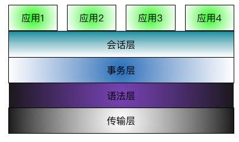
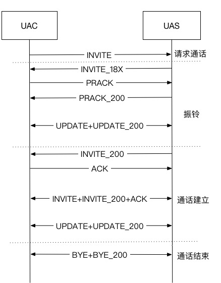
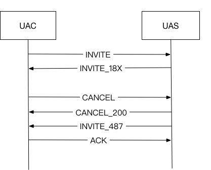

# JSIP 协议栈
---

JSIP 协议是 JSON SIP 的简写，是一个类 SIP 协议。旨在更容易的让互联网应用像 IMS  网络设备一样进行实时通信

JSIP 协议栈分为四层：

- 传输层：第一版本只支持 websocket
- 语法层：使用 JSON 格式对协议进行封装，该层主要对 JSON 中必填字段进行校验
- 事务层：和 SIP 协议相同，JSIP 每个事务是由一个请求和若干响应对应
- 会话层：主要是针对 INVITE 请求创建的会话，对会话状态进行检查

协议栈会对异常消息进行过滤，并对一些常规型的交互流程进行处理，从而降低应用复杂度

**这里的应用可以是即时音视频类应用(如会议，VoIP 等)，可以是即时消息类应用(点对点消息，聊天室消息等)**

[go-rtc-server](https://github.com/AlexWoo/go-rtc-server) 项目中的 rtclib/transport.go 是 GO 语言对 JSIP 传输层的实现，rtclib/jsip.go 是 GO 语言对 JSIP 语法层，事务层和会话层的实现

## 传输层

websocket 广泛应用于 web 端，app 端的消息推送服务，各种语言都有完善的 websocket 实现版本。JSIP 协议栈选择 websocket 作为传输层，方便后续各种语言的实现，也方便各种端接入网络。

考虑到一种常规应用，一个 app 提供了 webrtc 的音视频互动通信功能，电子白板和 IM 功能。由于三个功能是三个不同的会话，传统的方式，这个 app 需要建立三条 websocket 连接。如果网络端有大量 app 接入，大规模的连接势必会对网络端产生巨大的压力。特别是对一些大规模的应用，提供给 app 接入，和提供给 app 业务服务的服务器会进行分离。这样，对这个用户，接入点需要对外再建立三个连接，如果这个接入点接入用户过多，这个接入点的端口将会很快耗尽(毕竟 websocket 不是 http 的短连接服务)。这种会话和传输链路绑定的做法实际是一种很低效的方式。

JSIP 协议的会话层有独立的 ID 进行标识(后续章节会介绍)，因此，从协议层面，一个 websocket 连接可以同时传输多个 JSIP 会话，websocket 如果出现异常连接中断，在会话层超时前重建连接，仍不会对上层应用产生影响。

websocket URL：

- 非安全方式接入：ws://$domain/rtc?userid=$userid
- 安全方式接入：wss://$domain/rtc?userid=$userid

		$domain 用于客户端标识客户端到服务端的传输通道
		$userid 用于服务端标识客户端到服务端的传输通道

	断线重连时，客户端或服务端可以根据相应的标识将传输通道重新绑定到对应的会话上

## 语法层

语法层使用 JSON 格式对 JSIP 协议进行了包装，这样可以方便各种语言对 JSIP 协议进行编解码。在解码时，语法层会对以下参数进行校验：

- Type：SIP 请求类型(如 INVITE，BYE，MESSAGE 等，可选值参考 SIP 协议)或 RESPONSE
- Request-URI：对于 JSIP 请求，必填。外发时，对于会话的第一个请求，如果没有 Router 头，会使用 Request-URI 进行路由
- Code：对于 JSIP 响应，必填，值在 100-699 之间，100-199 为临时响应，200-299 位正确响应，300-399 为重定向响应，400-499 为客户端错误，500-599 为服务端错误，600-699 为全局错误，具体响应值参考 SIP 协议
- From：请求发起方
- To：请求目的方
- DialogueID：会话 ID，标识一个唯一的会话，相当于 SIP 协议中的 Call-ID + From-Tag + To-Tag
- CSeq：事务序号，在同一个会话中，不同请求的 CSeq 必须不同，DialogueID+CSeq 标识一个唯一的事务，相当于 SIP 协议中的 branch。响应的 CSeq 必须与其对应的 CSeq 相同(**这里的 CSeq 与 SIP 协议是有差别的**)

由于直接使用 JSON 对消息进行封装，JSIP 协议中不需要 Content-Length 头。两个特殊的可选头：

- Router：当有 Router 头时，使用 Router 头中第一个 URI 进行路由，多个 URI 使用 ',' 进行分割，URI 参数使用 ';' 进行分割。这里摒弃 SIP 中的松散路由概念，即无 lr 参数
- Body：消息体，在 INVITE 中可以使用 Body 传递 SDP，在 MESSAGE 中可以使用 Body 传递 IM 消息
- RelatedID：ACK 请求和 CANCEL 请求需要携带 RelatedID，ACK 的 RelatedID 与其对应的 INVITE 请求的 CSeq 相同，CANCEL 的 RelatedID 与其要取消请求的 CSeq 相同

## 事务层

JSIP 的事务由一个请求加请求的若干个响应组成，其中可以有多个临时响应，只能有一个最终响应

在临时响应中，100 Trying 是一个比较特殊的响应，一般对端回送 100 Trying 表示协议栈已经收到了该请求，但是上层正在进行处理。从 SIP 层面上，为了降低开销，一般协议栈并不是收到请求就要立即回送 100 Trying，而是将请求交给上层后，一定时间内(一般是百毫秒级别)未收到上层的响应，才需要发送 100 Trying。而 180，181，182，183 等临时响应皆是为 INVITE 请求设计的，其它请求一般不使用

如果一个请求在指定时间内未收到响应，对于请求发送方可以使用 CANCEL 请求取消该请求，对应请求接收方可以使用 408 响应结束该请求

ACK 是一个特殊的事务，他没有任何响应，与 INVITE，INVITE 的最终响应一起构成 INVITE 请求的三次握手

## 会话层

对于非 INVITE 会话，会话生命周期和事务事务生命周期一致

### INVITE 会话

上图为一个 INVITE 会话的完整流程，INVITE 设计初衷是一个通话过程，这个过程包括请求通话，振铃，通话建立和通话结束。分别对应 BICC/ISUP 中的 IAM，ACM，ANM 和 RLC，以下对整个过程做一个简单介绍

**振铃**

振铃阶段是被叫收到请求通话，在被叫摘机前这个区间的流程。这个流程实际是可选的，如用户加入会议室，会议室并没有摘机这个动作，因此对类似的流程，是没有振铃阶段的。

如果临时响应需要必达，则需要对临时响应作一个回应(类似于 INVITE 最终响应的 ACK)，这个响应即为 PRACK，而 PRACK 是需要 PRACK\_200 作为响应的。PRACK 和 PRACK\_200 是一个可选流程

当用户在振铃阶段如果已经完成了 offer-answer 交互，如果需要更新媒体，则需要使用 UPDATE + UPDATE_200 振铃阶段的媒体重协商

当收到 INVITE_200 后，INVITE 会话进入通话建立阶段

**通话建立**

在用户通话过程中，如果媒体需要发生更新，则需要使用相同的 DialogueID 发起新的 INVITE，对媒体进行重协商，这个过程我们称之为 Re-INVITE。如用户保持呼叫，需要将媒体属性修改为 sendonly，如用户通话在纯音频和音视频通话之间切换，如 SFU 会议中有第三方加入，或者有参会者退出，都会使用到 Re-INVITE

通话建立过程中的 UPDATE 和 UPDATE\_200 用户会话 keepalive，不能携带 SDP。一般 INVITE 中携带 Expire 头，在通话建立过程中，为防止一段异常掉线时能够清理 INVITE 会话，UAC 需要在 Expire 到期前向 UAS 发送 UPDATE，UAS 回应 UPDATE\_200

当 UAC 和 UAS 任意一段发送 BYE 时，整个通话结束，需要回收媒体资源

通话建立后使用 BYE 结束会话，通话建立前需要使用 CANCEL，或异常响应来结束 INVITE 会话，以下为 CANCEL 流程

被 CANCEL 的请求，需要回送 487 结束

## JSIP 协议栈应用层优化

**INVITE 非 200 异常最终响应**

- 收 INVITE 非 200 异常最终响应，协议栈层直接回送 ACK
- 发 INVITE 非 200 异常最终响应，协议栈收到 ACK 后不再转给应用

**CANCEL**

- 收 CANCEL，协议栈会回送 CANCEL_200 和 请求的 487 响应，并向应用 CANCEL
- 发 CANCEL，协议栈会拦截 CANCEL_200，但是会转发请求的 487 到应用

**BYE**

- 收 BYE，协议栈会回送 BYE_200，并将 BYE 转给应用
- 发 BYE，协议栈会拦截 BYE_200

**异常请求**

- 协议栈收到对话号不存在的异常请求，这些请求如果不能独立存在，协议栈会主动回送 481，能独立存在的请求有：INVITE，REGISTER，OPTIONS，MESSAGE，SUBSCRIBE

**INVITE 会话刷新**

- 在发送 INVITE 会话时，UAC 端会根据配置设置 Expire 超时时间，并在通话建立后，每隔 Expire/2 的时间，向 UAS 端发送 UPDATE，如果 UPDATE 超时，向对端和应用都发送一个 BYE 结束 INVITE 会话
- 在接收 INVITE 会话时，UAS 端会在通话建立后按照 INVITE 中的 Expire 设置定时器(如无 Expire 头，按照配置时间设置定时器)。如果 UAS 端收到会话刷新的 UPDATE，协议栈层直接回送 UPDATE_200，该请求不会发到应用；如果 UAS 会话刷新定时器超时，向对端和应用都发送一个 BYE 结束 INVITE 会话

**请求超时**

- 发送一个请求后，如果在一定时间内收不到响应，协议栈主动外发 CANCEL，并向应用层发送 408
- 接收请求转发给应用后，如果在一定时间内收不到应用的响应，协议栈会向应用发送 CANCEL，并给对端回送 408