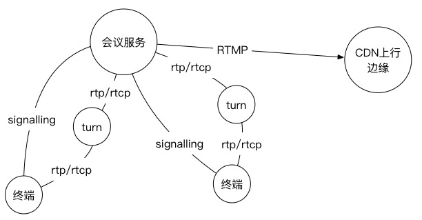
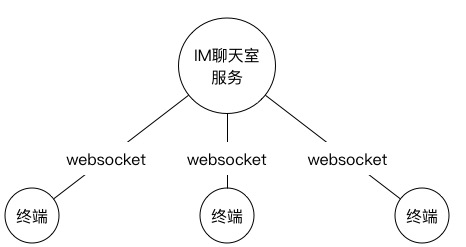
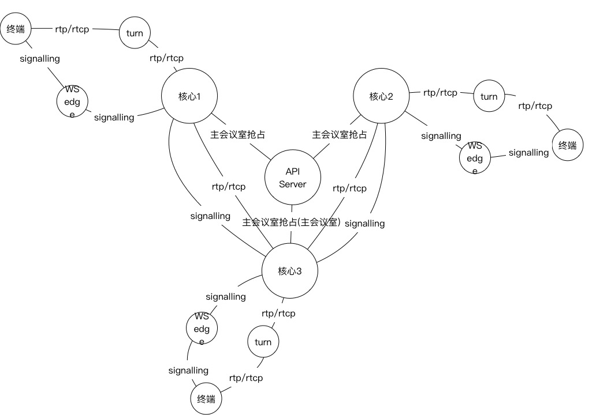
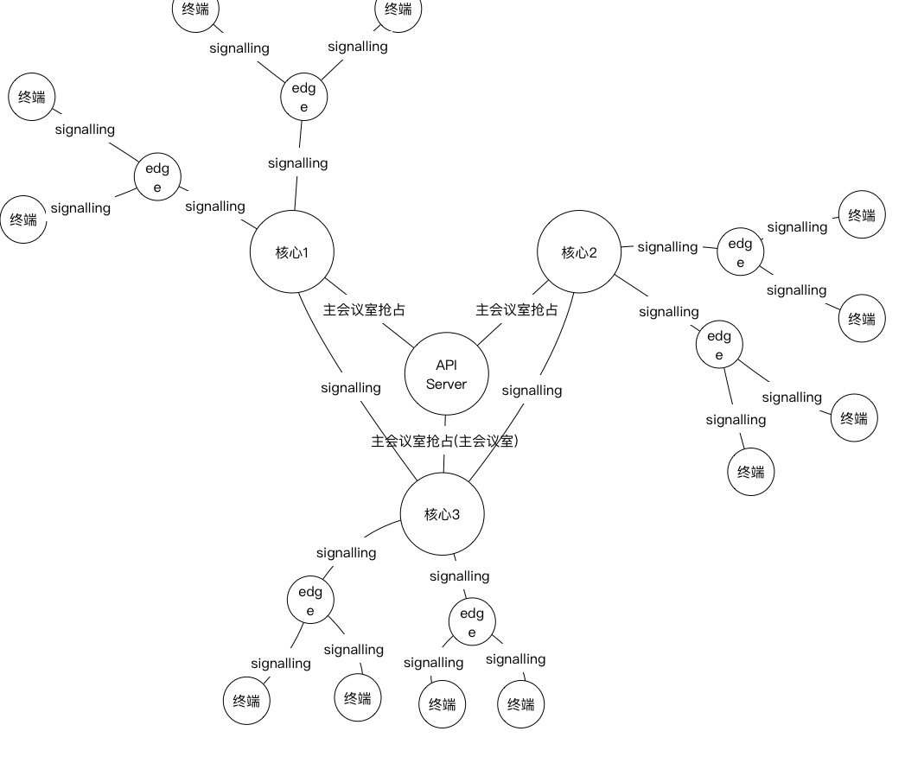

# 实时互动业务
---

对于传统的页面，点播业务，到近两年来兴起的直播，都是依赖于 CDN 网络的单向数据传播业务。随着业务场景需求，实时互动正在扮演着越来越重要的场景。我们已经看到很多直播中都加入了实时互动的元素：

- 直播中最早的互动方式，直播间里观众通过消息，弹幕等方式刷屏和主播进行互动
- 直播连麦，两个或多个主播进行实时互动，然后把互动内容通过 CDN 进行直播
- 抓娃娃机，通过安装在抓娃娃机的摄像头，让抓娃娃设备与游戏者进行实时互动，完成游戏
- 直播答题，主播在直播过程中插入题目(配合导播完成)，观众进行答题，并获取最终的奖励
- ……

我们可以看到加入实时互动以后，直播的业务场景得到了大大的丰富。随着技术的逐步成熟，技术门槛和网络成本的逐步降低，人类日常的社交方式也将逐步从文字，语音开始向视频方式转换

本篇主要对实时互动技术做一个简单的探讨

## 最简单的架构

实时互动技术总的来说主要是两个方面：

- 消息类的实时互动
- 媒体类的实时互动，媒体类包含语音和视频两种

一般在用户量比较小的时候，多数业务方都会采用 BGP 作为业务核心系统，覆盖所有终端用户

**连麦：**

**聊天室：**

以上架构，一般满足小规模业务场景是没有任何问题，如果业务规模较大，可能会出现很多问题：

1. BGP 机房成本太高
2. 所有终端用户到 BGP 机房的网络质量可能会存在问题
3. 单点问题，对于这个问题，可能有人会提，我可以选用几个 BGP 机房来做，那这几个机房是负荷分担还是热备关系，如果是主备，如何解决脑裂问题。到这一层面，运维的难度就会更加复杂

## CDN 融合架构

其实从业务模式来说，直播和实时互动有一定的相通性：直播有主播推流的上行流程和观众拉流的下行流程，而实时互动对于每个参与方来说，既是主播也是观众

而从网络层面上来说，分层架构可以基本解决网络不可达问题。这种分级架构，其实并不是 CDN 特有的，在电信系统里面，分级架构是其传输网络的基础架构。其实无论是 IM 聊天室，还是会议服务，其实更多的是电信业务的模式，这里提的 CDN 融合架构，实际上是利用 CDN 天生的网络优势，去融合实时互动甚至是实时通信的业务

### 连麦

直播 CDN 会有多个汇聚核心，分别用于覆盖不同区域，通过链路选优服务，每个区域的边缘节点到汇聚核心都能保证较高的网络质量。

选点上，将实时互动的业务服务器与直播 CDN 核心部署在一起，边缘传输节点与直播 CDN 边缘部署在一起。直播和实时互动的选优服务主要测量指标为延迟和丢包率，这点上面两个服务是通用的，所以在调度层面上，可以进行一部分的复用

对于不同区域的实时互动参与者，会进到不同核心的业务服务器上，而这些服务器之间再做一层桥接，实现跨区域的音视频会议

以上，通过 API Server 对主会议室进行抢占，未抢占到主会议室的核心向主会议室核心进行桥接，各会议室向 API Server 定时发送心跳，一旦主会议室出现异常，从会议室会抢占成为主会议室恢复

WS edge 是 websocket 边缘，turn server 可以和 websocket 边缘部署在一起，分布在 CDN 边缘节点，保证到用户终端的可达性。用户终端可以通过 IP 调度或者 DNS 调度找到离自己最近的边缘节点

一般音视频会议参与方有人数上限，所以对于这类业务，不需要在边缘进行汇聚，直接通过核心汇聚

当边缘到核心连通性不好时，需要考虑加一级中转节点，这个中转节点可以称作 media gateway，该网元会将用户的 signalling 直接桥接到最近的核心，在这里也需要做一次 SDP 映射。功能可参考 IMS 中的 SBC

### 聊天室

对于聊天室，其实是一种大规模的消息分发，可以参考直播中主播房间中观众的文字互动或者弹幕消息(这里暂时不考虑必达消息的处理方式)。如果全部汇聚到一个核心服务器，这个消息量是很可观的，核心连接数必然会影响到核心服务器的性能，这里就需要考虑多级汇聚的架构方式。

通过多级汇聚后，到核心的连接数和消息数都会大大减少

### 性能上的改进

对于规模较小的情况，使用 websocket 基本可以满足要求，各种 http 架构对 websocket 的支持也较好。如果服务器连接处理成为瓶颈，则需要考虑使用 UDP 通道的方式替代 websocket