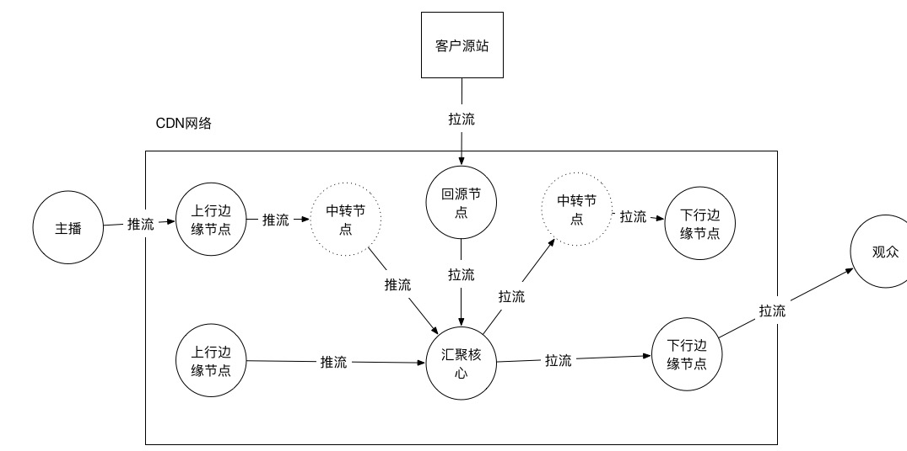
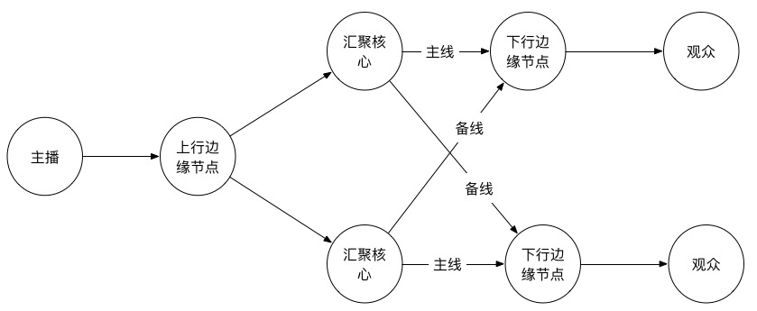
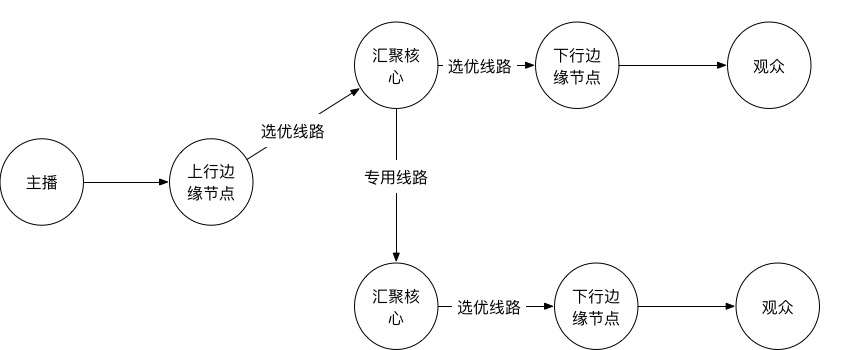

# 直播 CDN 分发网络(网络架构)
---

## 网络拓扑

和传统页面，点播业务的 CDN 只有下行分发不同。对于一些秀场，游戏类的直播场景中主播一般是分散在全国各地的，所以直播架构中是分为上行汇聚和下行分发两套网络。而对一些现场活动，赛事制作方的直播，更多的是业务方提供一个源站，由 CDN 去拉取后进行分发。

- 主播推流模式

	1. 主播推流到上行边缘节点
	2. 上行边缘节点将流推到汇聚核心。在有些环境中，上行边缘节点到汇聚核心网络状况并不好，这时候需要多走一层中转
	3. 汇聚核心收到流后，和 CDN 一样，不需要主动将流分发到边缘(需要预热的情况除外)，一些转码，水印，录制类业务一般在汇聚核心完成

- 回源拉流模式

	1. 当用户有访问到汇聚核心后，汇聚核心向一个回源节点拉流，回源节点向客户源站拉流

- 下行观看流程

	1. 观众到边缘节点拉取直播流
	2. 边缘节点上如果有流，直接发送给观众，如果没有流则会向上一级回源
	3. 上一级节点可能是中转节点，也可能是汇聚核心。一般会在两种情况下选取是否走中转节点：下行边缘到汇聚核心链路质量；汇聚核心处理能力(中转节点和下行边缘一样有 Cache 的能力，可以做回源收敛)

	下行观看流程和传统 CDN 类似，会有直播数据 Cache，由于实效性问题， Cache 时间一般是直播最近几秒的数据，一般多采用内存 Cache 的方式。因此直播业务的回源率比传统 CDN 要高很多。

	在直播中，Cache 时长，主播观众分布和观看人数。

## 网络架构

对于 CDN 来说，不可能只使用一个汇聚核心：

- 首先一个汇聚核心就意味着单点，一旦遇到网络故障或者机房割接，整个直播业务就会瘫痪
- 一个汇聚核心无论怎么选点，不可能覆盖全国，甚至国外的所有边缘节点，这样就需要大量的中转节点，对资源也是一种消耗

因此，直播一般会使用多汇聚核心的架构，下面介绍两种常用的网络架构方式。

### 网络架构1

架构 1 的思路就是保证每个汇聚核心都有流，下行边缘无论到哪个核心都能拉到流。好处就是不需要使用数据库去记录流是推到哪个核心的，从架构上来说比较简单粗暴，但是存在以下问题：

- 上行边缘需要推两份流到汇聚核心，会造成带宽浪费，因为对直播来说，很多主播实际上并没有太多观众
- 上行边缘到两个核心的质量不能保证都好，如果上行边缘到某个汇聚核心的链路质量较差，那从这个汇聚核心拉流的观众质量必然都差
- 为了解决上行边缘到所有核心的链路问题，就需要选取很多中转节点，或者使用 BGP 机房作为上行边缘，这样会造成更大的成本浪费

综上，这种架构不适合太多的核心，更适合多选取中转节点的方式来保证质量

在这个网络架构中，基本思路：下行节点是可以进行选优的，即下行边缘将一个汇聚核心作为主核心，只有当链路异常时才去备用汇聚核心拉流

### 网络架构2

架构 2 的思路就是链路选优，上行到一个链路最优的核心，下行也到一个链路最优的核心，两个核心之间使用专线打通，以保证质量。一般情况下，国内最多使用 3 个核心就能覆盖国内主要区域和运营商，5 个核心就能基本覆盖全国所有边缘节点。核心之间可以使用专线为主，公网为辅的方式，这样对骨干网异常也能起到一定的容错性

相对网络架构1，网络架构2更能保证直播的质量，但是存在一些技术难点

- 链路选优问题，这个需要进行长期实时数据监控，运营调整，当然，是完全可以做到自动的
- 流生命周期问题，直播流在哪个汇聚核心，是汇聚核心之间互相能拉到流的基础，而直播流是一个长时间存在的，因此需要对直播流开始，结束状态进行维护。当然考虑到一些异常节点挂掉的情况，还需要加入开始和结束之间的心跳来保证异常数据清理
- 多一级拉流会增加首屏时间

当然核心间互拉也可以改成互推的方式，这样可以省去一些流生命周期管理的麻烦，但是和网络架构1一样会浪费资源